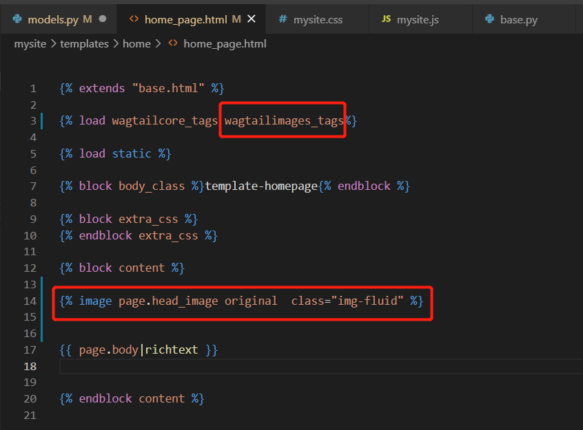

# 修改model.py文件

1. 在class HomePage 追加image field

```
class HomePage(Page):

    # 追加image field
    head_image = models.ForeignKey(
        'wagtailimages.Image',
        null=True,
        blank=True,
        on_delete=models.SET_NULL,
        related_name='+'
    )
```
2. 在panels追加image
```

class HomePage(Page):

    # 追加image field
    head_image = models.ForeignKey(
        'wagtailimages.Image',
        null=True,
        blank=True,
        on_delete=models.SET_NULL,
        related_name='+'
    )

    # 在panels追加image
    content_panels = Page.content_panels + [
        ImageChooserPanel('head_image'),
    ]
```

# 修改template home_page.html

1. 追加 load wagtailimages_tags

2. 追加 image tag



结果如下


# image field

