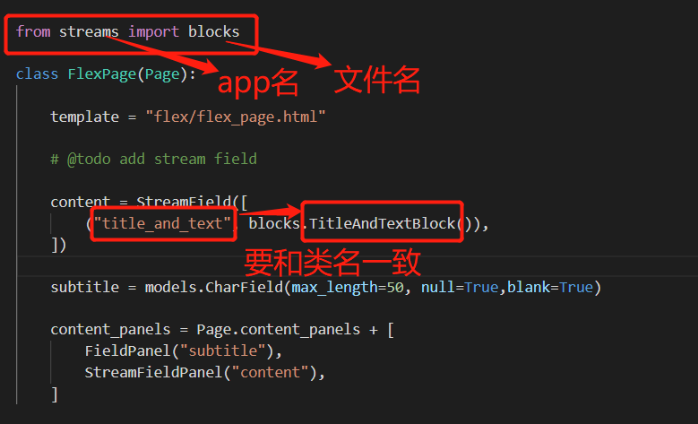
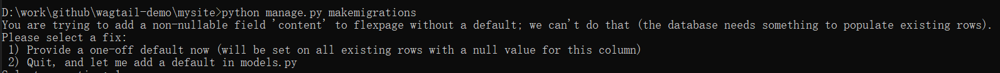
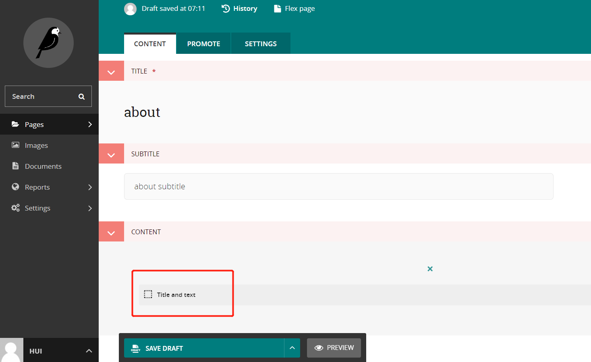
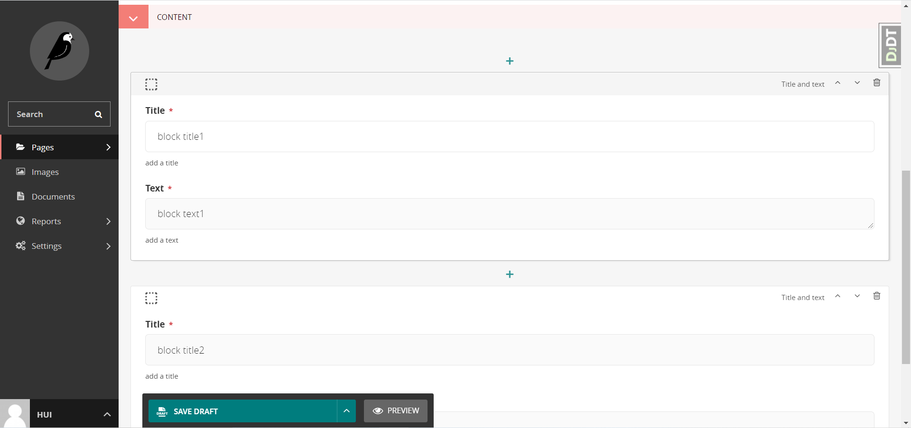
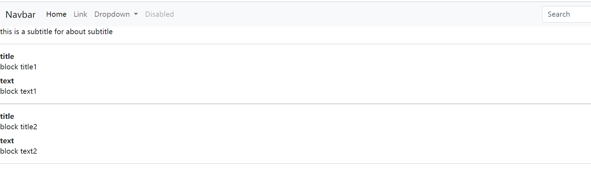

# Stream field

象前面的页面中 title，subtitle，用的是CharField是静态的不可移动增加的，Stream field是动态的可以追加移动的，因此我们先创建一个Streams App.

# 生成一个streams app

执行以下命令，生成stremas app

```
cd wagtail-demo/mysite
python manage.py startapp streams
```

# add streams to base.py

```
INSTALLED_APPS = [
    ...
    'streams',
    ...
]
```

# create a blocks.py

在streams目录下新建一个blocks.py文件

1. 新建class TitleAndTextBlock

2. 新加block字段 title， text

3. 新建class Meta 用来显示在 admin页面中

```
from wagtail.core import blocks

class TitleAndTextBlock(blocks.StructBlock):

    title = blocks.CharBlock(required=True, help_text="add a title")
    text = blocks.TextBlock(required=True, help_text="add a text")

class Meta: 
    template="stremas/title_and_text.html"
    icon = "edit"
    label = "Title & Text"
```


# 修改 flex/modles.py文件

## 1. import StreamField, StreamFieldPanel

```
from wagtail.core.fields import StreamField

from wagtail.admin.edit_handlers import FieldPanel, StreamFieldPanel
```

## 2. 定义StreamField

import blocks
```
from streams import blocks

content = StreamField(
    [
        ("title_and_text", blocks.TitleAndTextBlock()),
    ],
    null=True,
    blank=True,
)

```



## 3. add StreamFieldPanel into content panel

```
content_panels = Page.content_panels + [
    FieldPanel("subtitle"),
    StreamFieldPanel("content"),
]
```

### 执行 python manage.py makemigrations
   会在migrations目录下自动生成一个字段定义的文件

    如果遇到下面的问题，是因为没有定义 null=True,blank=True
   

### 执行 python manage.py migrate to update the database
   会生成数据库表的字段

# 新建 streams/title_and_text.html template文件
```


<div>
    {{ self.title }} 
</div>

<div>
    {{ self.text }} 
</div>


```

# 修改 flex_page.html template文件
修改mysite/flex/flex_page.html文件

```







<div>
    this is a subtitle for {{ page.subtitle }} 
</div>

<hr>


    
    <hr>



```

# 运行 结果
会显示以下页面



可以追加多个



