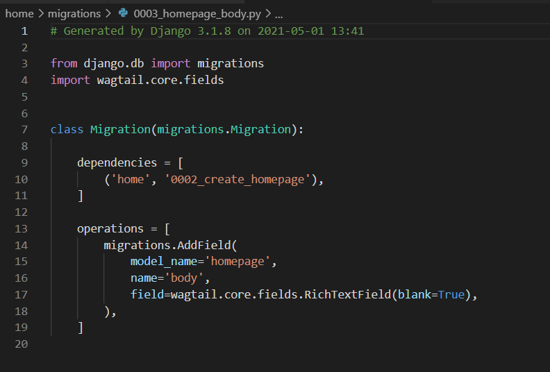
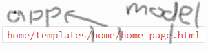
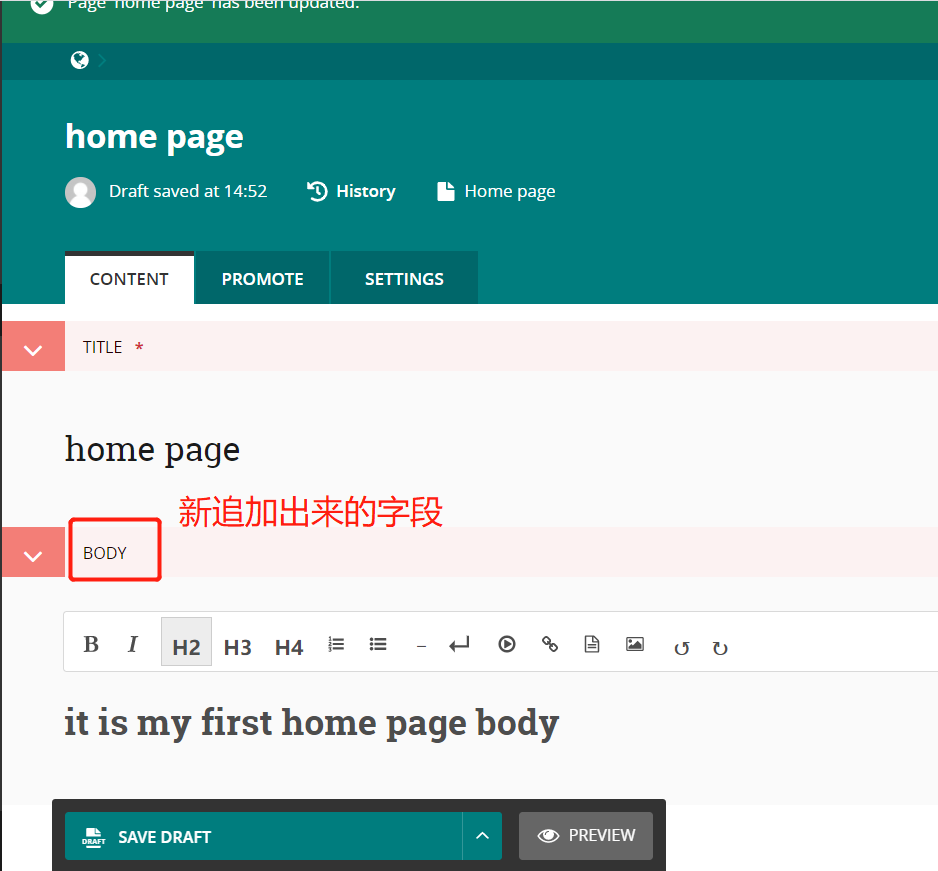
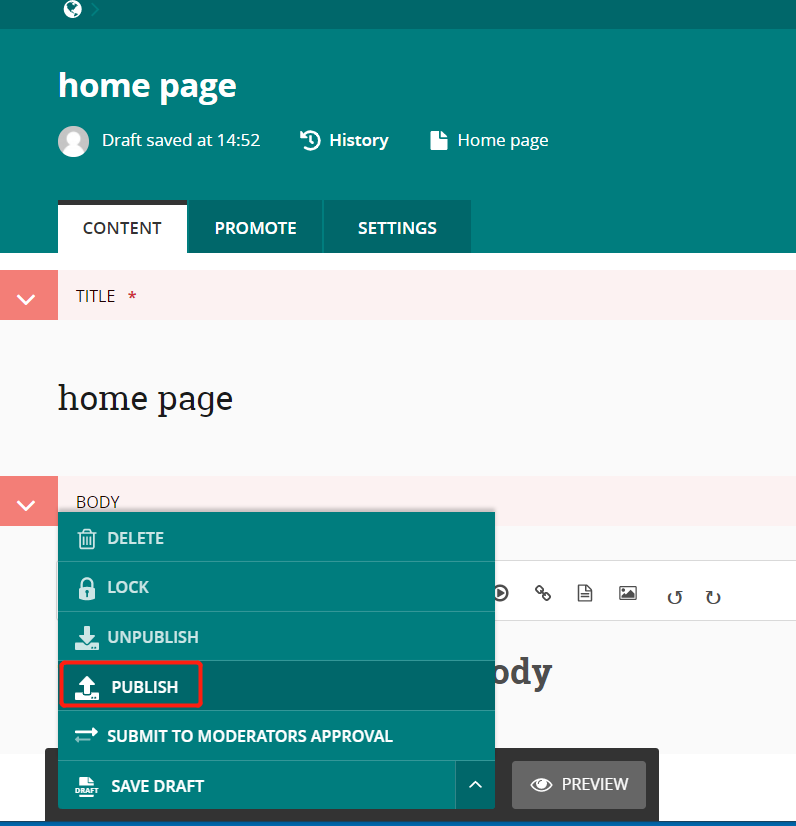
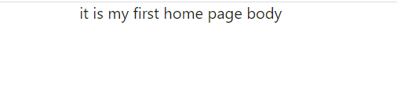

给home页面追加一个body字段

# 修改home/models.py
1. 追加一个body字段为richtext，代码如下
    ```
    from django.db import models

    from wagtail.core.models import Page
    from wagtail.core.fields import RichTextField
    from wagtail.admin.edit_handlers import FieldPanel


    class HomePage(Page):
        body = RichTextField(blank=True)

        content_panels = Page.content_panels + [
            FieldPanel('body', classname="full"),
        ]
    ```

2. Run python manage.py makemigrations
   会在migrations目录下自动生成一个字段定义的文件
     
3. then python manage.py migrate to update the database
   会生成数据库表的字段

# 修改home page template
文件在templates目录下命名规则为app名/model名.html
例如


追加mysite/templates/home/home_page.html如下

```




template-homepage


    {{ page.body|richtext }}

```

# 在页面上编辑home page
填写title，body

点击save，publish


访问 localhost:8000 显示如下页面

