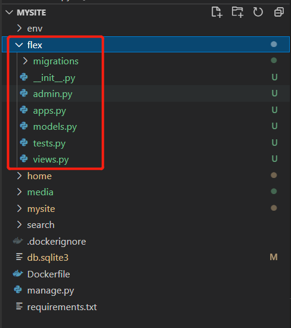

# 生成一个flex app

执行以下命令，生成flex app

```
cd wagtail-demo/mysite
python manage.py startapp flex
```

这样就会在mysite目录下生成flex app



# add flex to base.py

```
INSTALLED_APPS = [
    ...
    'flex',
    ...
]
```

# 追加models.py

1. 追加field
2. 追加content_panels
3. 追加Meta class

```
""" flexabel page """

from django.db import models

from wagtail.admin.edit_handlers import FieldPanel 
from wagtail.core.models import Page

class FlexPage(Page):

    template = "flex/flex_page.html"

    # @todo add stream field

    # content = StreamField()

    subtitle = models.CharField(max_length=50, null=True,blank=True)

    content_panels = Page.content_panels + [
        FieldPanel("subtitle"),
    ]

class Meta: 

    verbose_name = "flex_page"
    verbose_name_plural = "flex_pages"
```

### 执行 python manage.py makemigrations
   会在migrations目录下自动生成一个字段定义的文件

### 执行 python manage.py migrate to update the database
   会生成数据库表的字段

# 追加一个template文件

在mysite\template下追加flex/flex_page.html

```







this is a subtitle for {{ page.subtitle }} 



```