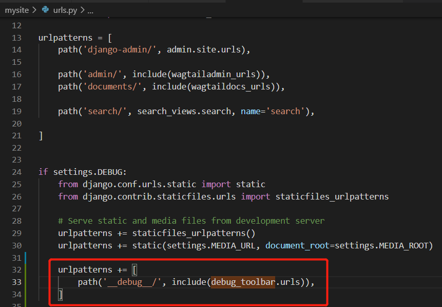
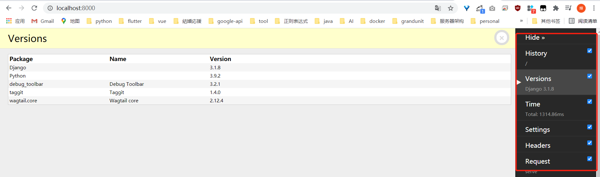

# install

https://django-debug-toolbar.readthedocs.io/en/latest/

```
$ python -m pip install django-debug-toolbar

```

## Prerequisites
在以下文件中确认
mysite->settings->base.py
Make sure that 'django.contrib.staticfiles' is set up properly and add 'debug_toolbar' to your INSTALLED_APPS setting

因为debug tool只有在开发环境中使用可以设置在dev.py中

```
INSTALLED_APPS = [
    # ...
    'django.contrib.staticfiles',
    # ...
    'debug_toolbar',
]

STATIC_URL = '/static/'

```

## Setting up URLconf

Add the Debug Toolbar’s URLs to your project’s URLconf:
mysite->url.py

```
import debug_toolbar
from django.conf import settings
from django.urls import include, path

urlpatterns = [
    ...
    path('__debug__/', include(debug_toolbar.urls)),
]
```



## Enabling middleware

在以下文件中追加
mysite->settings->dev.py

```
MIDDLEWARE += [
    'debug_toolbar.middleware.DebugToolbarMiddleware',
]
```

## Configuring Internal IPs

The Debug Toolbar is shown only if your IP address is listed in the INTERNAL_IPS setting. This means that for local development, you must add '127.0.0.1' to INTERNAL_IPS; you’ll need to create this setting if it doesn’t already exist in your settings module:

在以下文件中追加
mysite->settings->dev.py

```
INTERNAL_IPS = [
    '127.0.0.1',
]
```

刷新页面会出现以下画面

