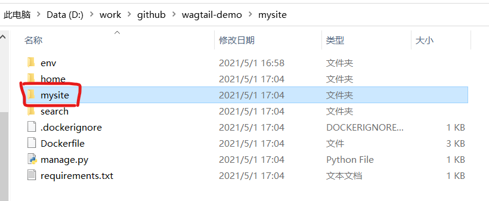
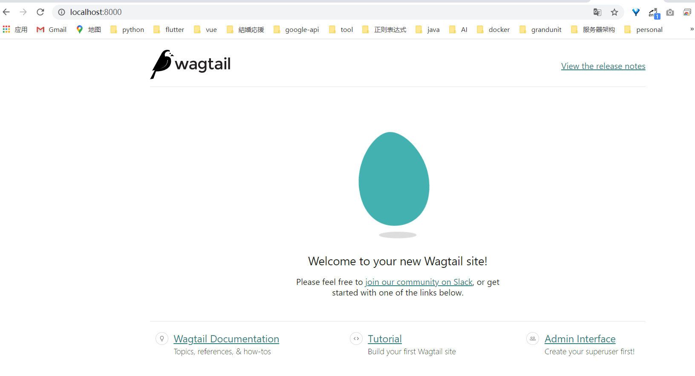
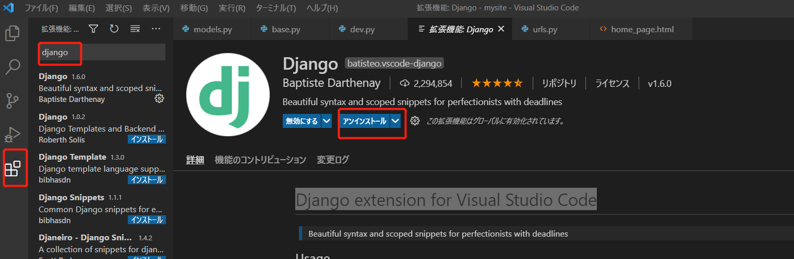

# Install and run Wagtail

## Install dependencies

Wagtail supports Python 3.6, 3.7, 3.8 and 3.9.

To check whether you have an appropriate version of Python 3

```
python --version

Python 3.9.2
```
# Create and activate a virtual environment
这是创建一个虚拟环境，用来隔离和其他项目环境的影响

```
cd wagtail-demo
python -m venv mysite\env
```

会在wagtail-demo目录下创建一个mysite\env目录

# Install Wagtail
```
pip install wagtail
```

会安装在c:\users\hui\appdata\local\programs\python\python39\lib\site-packages目录下

# Generate your site

```
wagtail start mysite mysite
```

会生成如下的目录



# Install project dependencies
安装所需要的依赖库

```
$ cd mysite
$ pip install -r requirements.txt
```

# Create the database
默认的会用sqllite数据库
```
python manage.py migrate
```

# Create an admin user
```
python manage.py createsuperuser
```

# Start the server
```
python manage.py runserver
```

访问地址  http://127.0.0.1:8000 

hui/huanghui@grandunit.net/Grandunit123@




# install Django extension for Visual Studio Code


