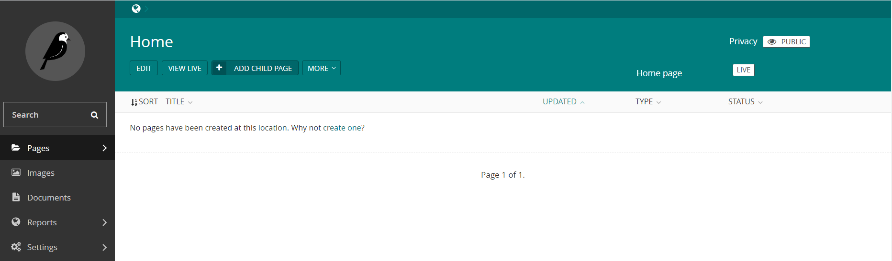
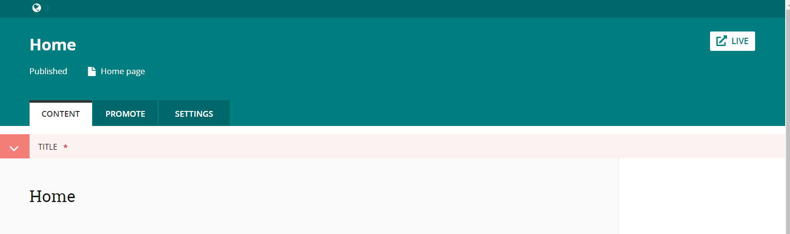
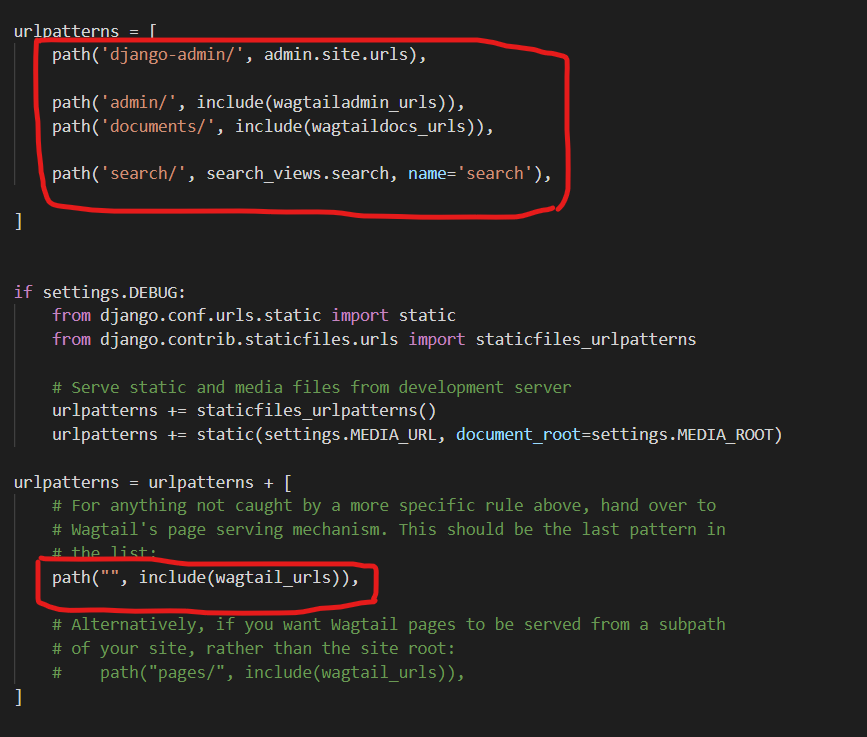
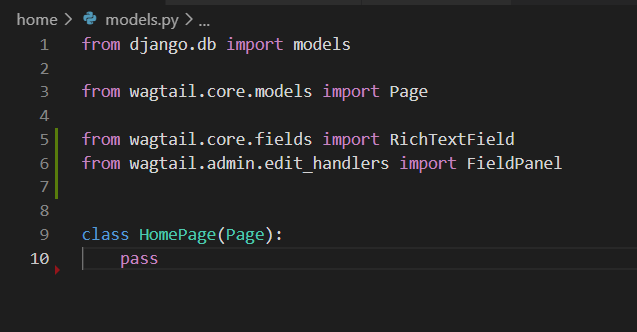
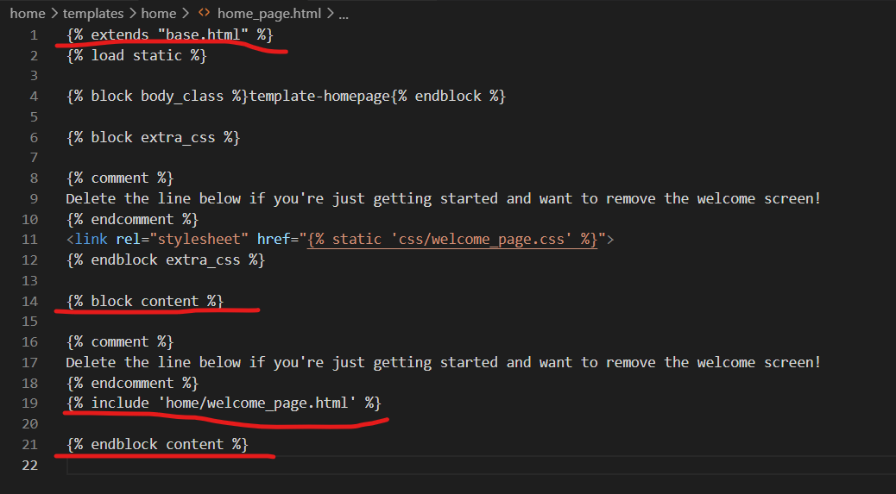

# 默认构造

## 默认会有一个home页面

点击edit默认只会有一个title

## 页面路由
这个home页面是怎么显示出来的呢
home/mysite/url.py

默认的定义如下四个路径和其余的路径
由path("", include(wagtail_urls)),来决定
这个貌似由文件结构来自动定义吧？

## model

应该就是页面预先定义的以一些元素如 title，body。。。
文件为home/models.py

## template
页面显示是由home template来定义的

